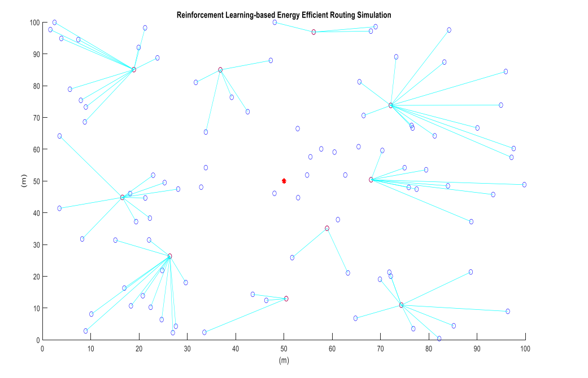
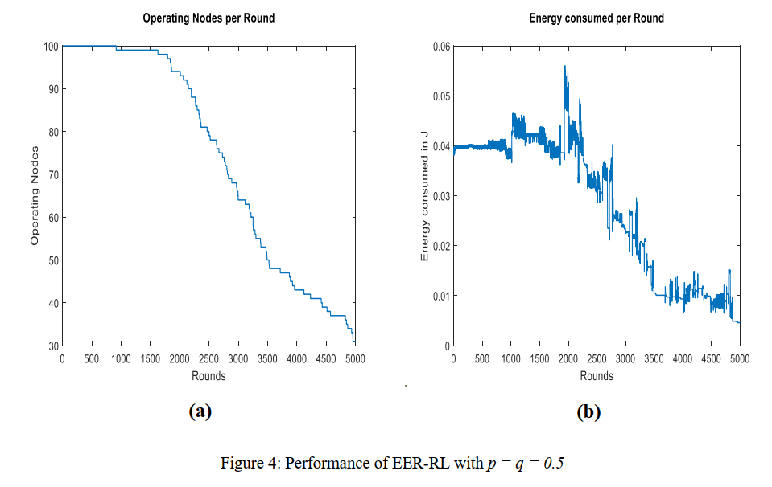
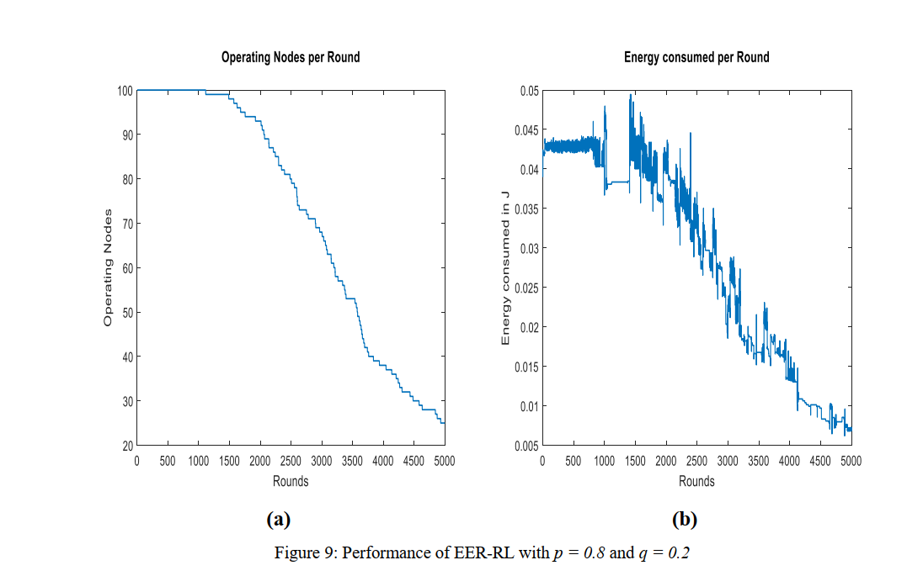
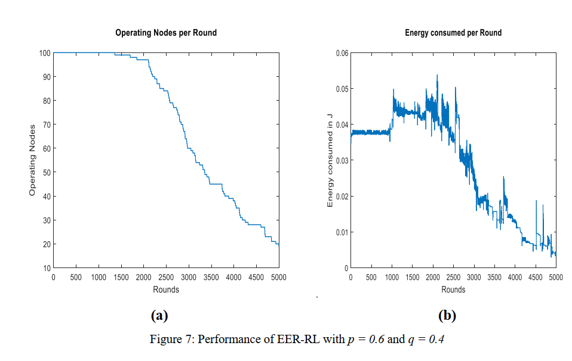

# Energy-Efficient-Routing-using-RL

Improving network lifetime is considered to be one of the most critical areas of focus within the domain of Wireless Sensor Networks (WSNs). This project presents a Modified Reinforcement Learning based Energy-Efficient Routing (MRL-EER) protocol for prolonging network lifetime. The proposed algorithm is founded on reinforcement learning principles, which is a machine learning technique. The aim of the approach is to enhance routing strategies to
maximize the overall reward received by individual nodes over an extended period. The reward function definition considers several factors, including link distance, residual energy, and hop count to the sink. These factors are taken into account to reduce overall energy consumption, achieve a balance to it, and enhance packet delivery. The performance of the proposed algorithm is compared with another RL-based energy-efficient routing protocol. The result shows that the proposed approach performs better in maximizing energy and increases the overall network's power by 18.18%.

# Expected Outcome

